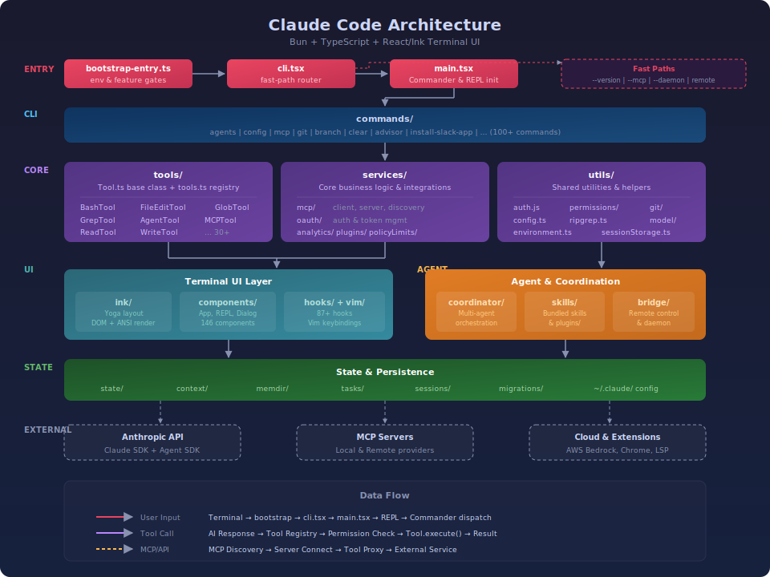

# 顶级Coding智能体

基于 Bun 运行时构建，提供交互式终端 REPL、多工具调度、MCP 集成与多 Agent 协作能力。

## 技术栈

| 层级 | 技术 |
|------|------|
| 运行时 | Bun 1.3.5+ / Node.js 24+ |
| 语言 | TypeScript (ESNext, ESM) |
| 终端 UI | React + 自定义 Ink fork |
| CLI 框架 | Commander.js |
| AI SDK | @anthropic-ai/sdk, @anthropic-ai/claude-agent-sdk |
| MCP | @modelcontextprotocol/sdk |
| 校验 | Zod |
| 遥测 | OpenTelemetry |
| 特性门控 | GrowthBook |

## 架构总览



## 项目结构

```
src/
├── entrypoints/          # 入口点 (cli.tsx, init.ts, mcp.ts, sdk/)
├── main.tsx              # 主应用 — Commander 注册、服务初始化、REPL 启动
├── bootstrap-entry.ts    # 启动引导 — 环境变量设置、特性门控
│
├── commands/             # 100+ CLI 命令实现 (agents, config, mcp, git 等)
├── tools/                # 30+ 工具定义 (Bash, FileEdit, Grep, Glob, MCP 等)
├── services/             # 核心服务层
│   ├── mcp/              #   MCP 客户端/服务端、工具发现与代理
│   ├── analytics/        #   遥测与分析
│   ├── api/              #   API 客户端
│   ├── oauth/            #   认证授权
│   ├── policyLimits/     #   组织策略限制
│   └── plugins/          #   插件系统
│
├── components/           # 146 个 React/Ink 终端 UI 组件
├── hooks/                # 87+ React Hooks
├── ink/                  # 自定义 Ink 终端渲染引擎 (布局、DOM、Bidi 文本)
├── keybindings/          # 快捷键系统 (标准 + Vim 模式)
├── vim/                  # Vim motion/operator/text-object 实现
│
├── skills/               # 技能管理 (bundled skills)
├── plugins/              # 插件系统
├── coordinator/          # 多 Agent 协作调度
├── bridge/               # 远程控制桥接
├── assistant/            # 会话发现与历史
│
├── state/                # 应用状态管理
├── context/              # Context Provider
├── memdir/               # 记忆目录管理
├── tasks/                # 任务列表
├── utils/                # 工具函数 (auth, config, git, permissions 等)
├── constants/            # 常量定义 (oauth, prompts, product)
├── schemas/              # JSON Schema 定义
│
├── screens/              # 全屏 UI 布局
├── outputStyles/         # 输出样式
├── query/                # 查询/搜索引擎
├── jobs/                 # 后台任务
├── remote/               # 远程执行
├── server/               # 服务端组件 (LSP 等)
├── native-ts/            # 原生模块桥接
└── migrations/           # 数据迁移

shims/                    # 本地包兼容层 (Chrome MCP, Computer Use 等)
vendor/                   # 原生绑定源码 (audio-capture, image-processor 等)
```

### 核心模块说明

**启动流程**：`bootstrap-entry.ts` → `entrypoints/cli.tsx` → `main.tsx` → REPL

- **cli.tsx** 实现快速路径分发 — 根据 CLI 参数直接路由到对应子系统（MCP 服务、Daemon、Bridge 等），避免不必要的模块加载
- **main.tsx** 负责完整初始化 — Commander 命令注册、认证鉴权、工具初始化、MCP 服务发现、进入交互式 REPL

**工具系统**：`src/Tool.ts` 定义基类，`src/tools.ts` 负责注册。每个工具封装一个独立能力（文件读写、Shell 执行、代码搜索等），通过权限模型控制访问。

**MCP 集成**：支持本地/远程 MCP Server 发现与连接，工具和资源代理，支持 Chrome MCP 和 Computer Use MCP 扩展模式。

**终端 UI**：基于 React + 自定义 Ink fork 构建，包含完整的布局引擎（Yoga）、DOM 渲染、ANSI 着色、Bidi 文本支持和 Vim 快捷键。

## 运行方式

### 环境要求

- Bun 1.3.5+
- Node.js 24+

### 安装依赖

```bash
bun install
```

### 方式一：Bun 直接运行（推荐）

```bash
# 启动交互式 REPL
bun run dev

# 或等效的
bun run start

# 直接传入 prompt
bun run dev "帮我写一个排序函数"

# 查看版本
bun run version

# 查看完整命令树
bun run dev --help
```

### 方式二：Bun 直接执行入口文件

```bash
# 跳过 package.json scripts，直接执行
bun run ./src/bootstrap-entry.ts

# 带参数
bun run ./src/bootstrap-entry.ts --version
bun run ./src/bootstrap-entry.ts --help
```

### 方式三：Node.js + tsx 运行

如果不想使用 Bun，可以通过 `tsx`（TypeScript 执行器）用 Node.js 运行：

```bash
# 安装 tsx
npm install -g tsx

# 运行
tsx ./src/bootstrap-entry.ts

# 带参数
tsx ./src/bootstrap-entry.ts --help
```

### 方式四：管道模式（非交互式）

```bash
# 通过管道传入 prompt
echo "解释一下这段代码" | bun run dev

# 从文件读取 prompt
bun run dev < prompt.txt

# 配合 -p 参数直接输出（非交互式）
bun run dev -p "用 TypeScript 写一个 hello world"
```

## CLI 子命令与模式

```bash
# 会话管理
bun run dev ps                    # 列出活跃会话
bun run dev logs                  # 查看会话日志
bun run dev attach <session>      # 接入已有会话
bun run dev kill <session>        # 终止会话

# 后台与 Daemon
bun run dev --bg                  # 后台运行
bun run dev daemon start          # 启动守护进程
bun run dev daemon status         # 查看守护进程状态

# MCP 服务模式
bun run dev --claude-in-chrome-mcp    # Chrome MCP 服务端
bun run dev --computer-use-mcp        # Computer Use MCP 服务端

# 远程控制
bun run dev remote-control        # 远程控制桥接模式

# 多工作区
bun run dev --tmux --worktree     # tmux + git worktree 模式

# 模板任务
bun run dev new <template>        # 从模板创建任务
bun run dev list                  # 列出可用模板
```

## 许可证

本项目仅供学习研究使用。
